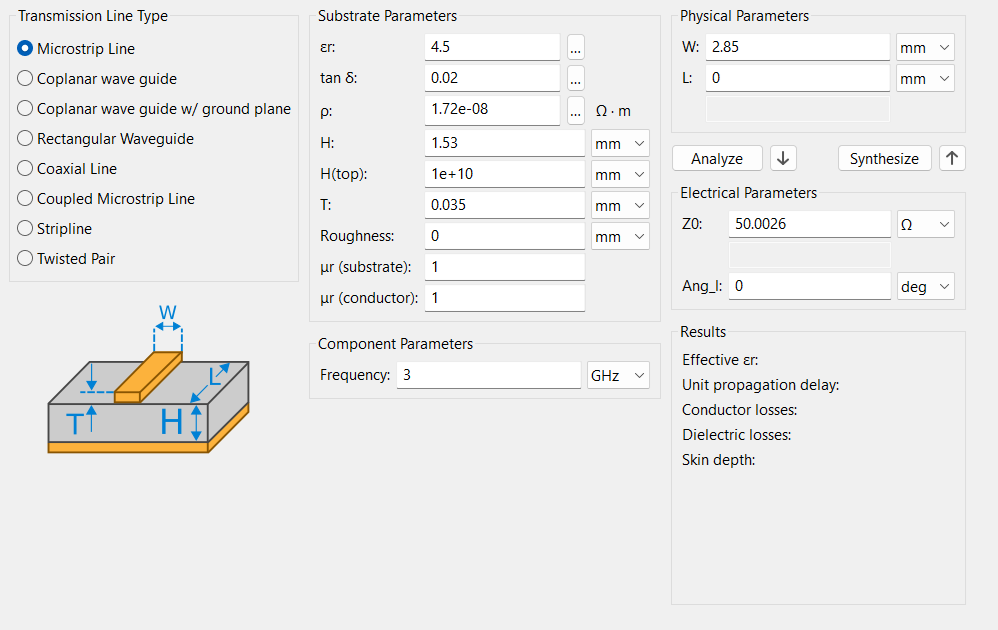
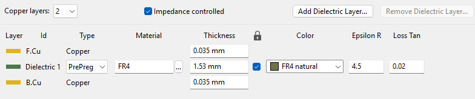
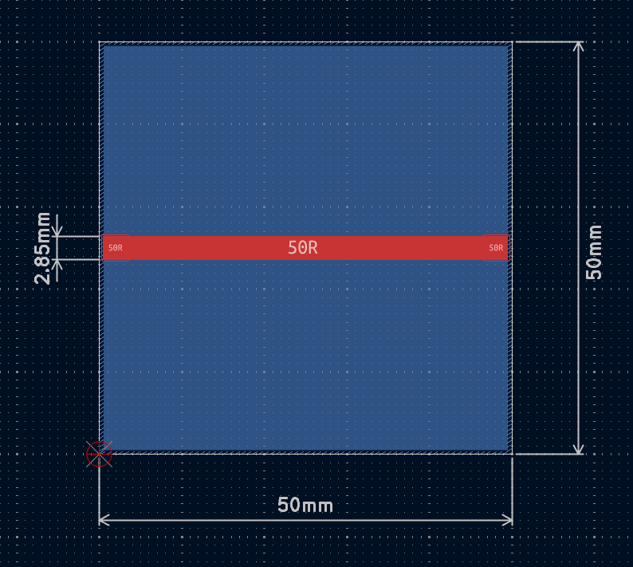
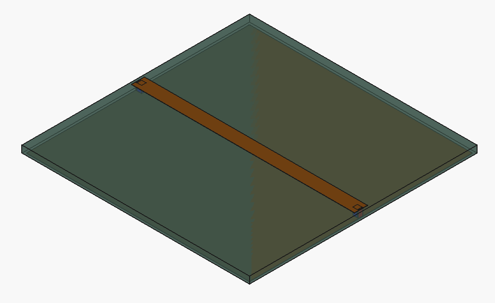

# Microstrip Simulation

This project aims to simulate the behavior and electrical parameters of a microstrip using KiCAD v9.0.6 design software and calculator, FreeCAD 1.0.2 modeling software, and OpenEMS, Emerge, and Elmer FEM software for electromagnetic simulations.

## Design

Using KiCAD calculator, we arrived at the following results for a microstrip in 3GHz:

As configured in calculator, the stack-up used was:

Using 1.85mm pads, the final design can be seen as following:

## Modeling

After the design was complete in KiCAD, it was imported into FreeCAD, added air box, port in, port out and .ini files for generating simulation scripts with [FreeCAD-OpenEMS-Export](https://github.com/LubomirJagos42/FreeCAD-OpenEMS-Export).

## Simulation

Simulations using the FDTD method aim to visualize electromagnetic fields propagating in 3D over time, allowing for the analysis of a system's response to different excitations, as well as in a broadband context. On the other hand, FEM solvers are time-independent and perform frequency response analysis of systems, which is widely used to characterize RF components or calculate electrical current density.

For these simulations, a response analysis to a 3GHz sine wave signal will be performed using OpenEMS, an S11 analysis using Emerge, and a current density analysis using Elmer.
